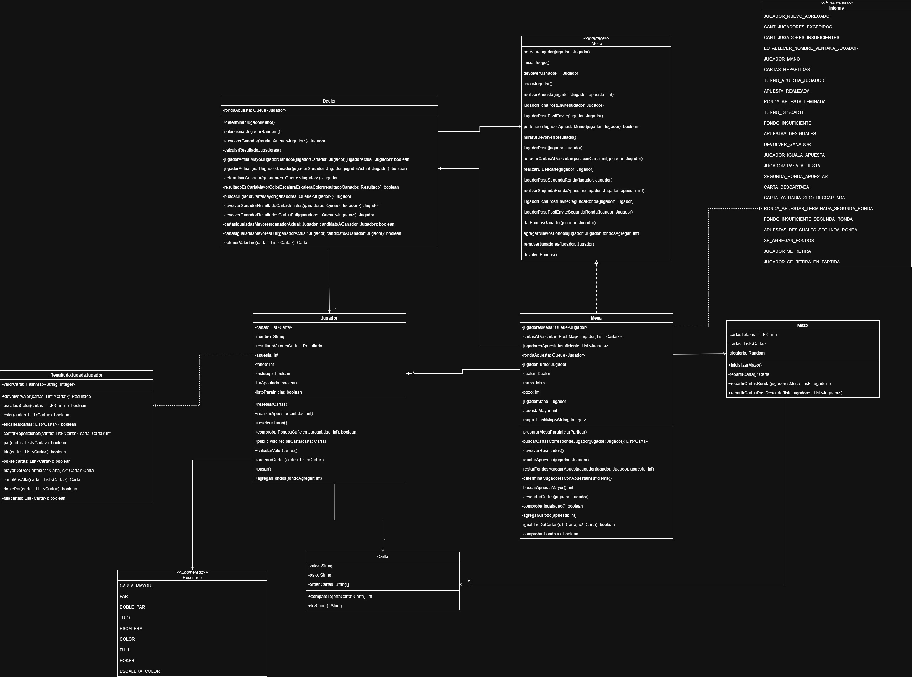

# FinalPoker

Este proyecto es el trabajo práctico final de la asignatura Programación Orientada a Objetos en la Universidad Nacional de Luján. Su objetivo es desarrollar un juego de póker multijugador en tiempo real, utilizando los patrones MVC y Observer, con persistencia mediante serialización.

## Tecnologías y patrones utilizados

- **Lenguaje:** Java (JDK)
- **Interfaz gráfica:** Java Swing
- **Control de versiones:** Git
- **Entorno de desarrollo:** Eclipse (IDE)
- **Patrones de diseño:** MVC, Observer
- **Persistencia:** Serialización
- **Librería RMI utilizada:** [RMIMVC](https://github.com/federicoradeljak/libreria-rmimvc) (provista por el equipo docente)

## Diagrama de clases

A continuación, se muestra el diagrama de clases del proyecto:



## Uso

1. Seleccionar el tipo de interfaz:

   Para elegir la interfaz gráfica o de consola, modifica la siguiente linea de codigo:

   **Interfaz gráfica**, usa:

   ```java
         IVista vista = VistaGrafica.getInstance();
      ```


   

     **Interfaz de consola**, usa:

      ```java
         IVista vista = new VistaConsolaSwing();
      ```

   

        
2. Ejecutar la clase AppServidor
   
     * Seleccionar dirección IP
       
       
       
     * Seleccionar puerto del servidor
       
       
       

3. Ejecutar la clase AppCliente

   * Seleccionar dirección IP

      
  
   * Seleccione el puerto para ese cliente

     
  
   * Seleccione la IP del servidor o presione directamente aceptar

     
  
   * Seleccione el puerto donde corre el servdor

     
  
   ### Notas adicionales
      * El proceso de ejecución de AppCliente debe repetirse por cada jugador que desee que participar en el juego, hasta un maximo de 7 jugadores.
      * Como el juego se ejecuta de manera local, cada cliente debe usar un puerto diferente para evitar conflictos.
